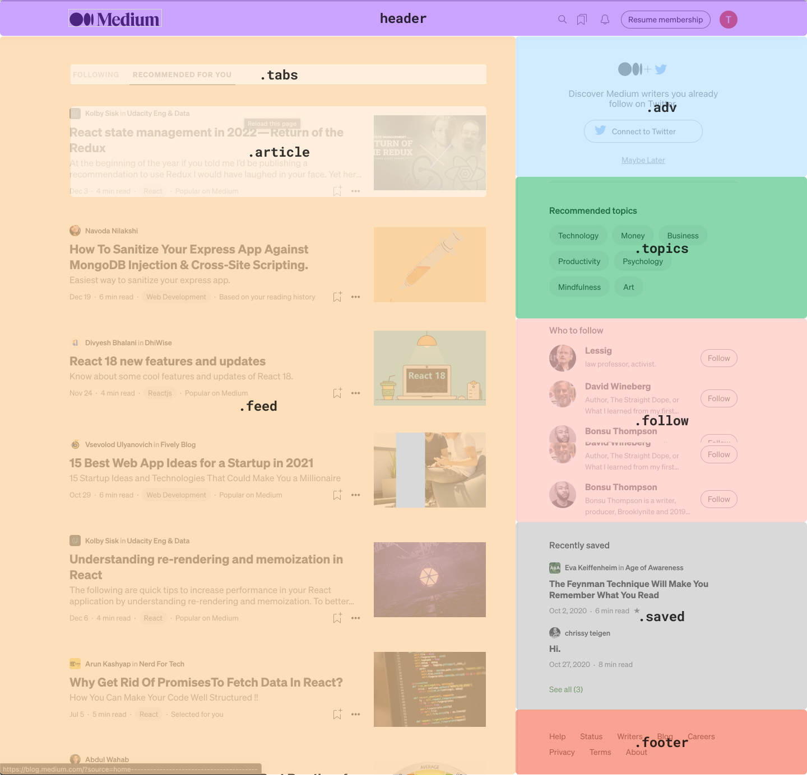

# Esercitazione del 16/06/2023
### Creazione della homepage di Medium partendo da un immagine di riferimento
Sono stati aggiunti inoltre alcuni comportamenti interattivi nella pagina, come lo styling in _hover_ dei pulsanti e di alcune icone. Questa è la quarta e ultima esercitazione del primo modulo del corso Web Development Part-time in Epicode. In questa cartella sono presenti tutti i file di progetto:

la cartella assets contenente le immagini usate per le cover degli articoli, le immagini degli autori e le icone presenti nell'interfaccia;
il file index.html con il codice HTML della pagina;
il file style.css con il codice CSS della pagina.

Per costruire la pagina, partendo dal riferimento visivo fornito, è stata disegnata una struttura di base preliminare da seguire per usare le classi in maniera coerente.

